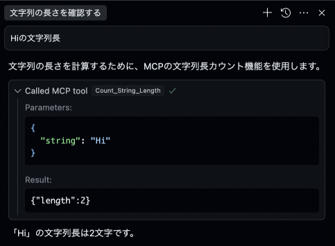

# preset-mcpserver-ts-local
> ref. https://github.com/punkpeye/fastmcp

fastmcp + TypeScriptで、ホストマシン上で動作するMCPサーバーを開発するためのテンプレートです。

# コンセプト
- TypeScriptを言語として採用することで、JSに組み込むケースをカバーします。また、denoを使ってTypeScriptを実行することで、面倒な設定をスキップして手早くMCPを試せるようにしています。
- 開発の際には `src/index.ts` に機能を実装します。
- 1Repositoryあたり1MCPサーバを実装することを意図しています。

> [!NOTE]
> 1Repositoryあたり複数のMCPサーバを実装する実装は避けます。MCP Serverを機能のグループ単位で1リポジトリとする理由は、MCPクライアント側でMCP serverのオプトイン/オプトアウトを制御しやすいようにするためです。MCPサーバ側で多くの機能を提供してしまうと、Agentがツール選択を間違う可能性が高くなってしまいます。このため本当に使用するツールだけをMCPクライアントに設定できるよう、オプトアウト可能な実装を行います。開発の際にはオプトアウトする単位でサーバーを分けられるような実装をしておくと便利です。

# 前提

- deno: 2.2.9
- Cursor: 0.48.7
- 言語: TypeScript

# クイックスタート on Cursor
与えられた文字列の長さを検証するサンプルのMCPサーバーを使う手順を説明します。

> [!NOTE]
> ここではCursorでの使い方を紹介しますが、各種MCPクライアントに以下と同様の定義を記載することで同じように使うことが可能です。

denoをCursorから実行できる状態にします。

```bash
asdf global deno 2.2.9
```

依存性をインストールします。

```bash
npm install
```

Cursor > Preference > Settings > Feature > MCP を開き、以下の設定を追加します。Cursor側でMCPサーバーが認識されればOKです。  

```json
{
    "mcpServers": {
        "string-process-preset": {
            "command": "deno",
            "args": [
                "run",
                "--allow-all",
                "/path/src/index.ts"
            ]
        }
    }
}
```

Cursor Agent で「Hiの文字列長を教えて」のように使用します。以下のようにMCPサーバの呼び出しが行われれば正常に動作しています。



# 関連情報

## denoをasdf経由でインストールするには

```
asdf plugin-add deno https://github.com/asdf-community/asdf-deno.git
asdf install deno 2.2.9
asdf global deno 2.2.9
```

# 参考
- https://zenn.dev/heavenosk/articles/fastmcp-simple-server
