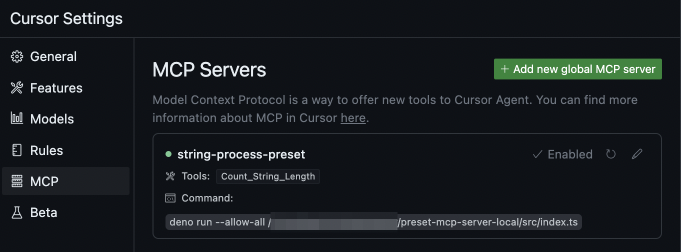

[](https://codespaces.new/Yoshida24/preset-mcpserver-ts-local)

# preset-mcpserver-ts-local
> ref. [fastmcp](https://github.com/punkpeye/fastmcp)

ホストマシン上で動作するMCPサーバーを開発するテンプレートです。  
fastmcp + TypeScriptで開発します。

## コンセプト
- TypeScriptベースでの開発をサポートします。
- Denoを使ってTypeScriptのセットアップを省力化します。

## 前提

- Deno: 2.2.9
- Cursor: 0.48.7
- 言語: TypeScript
- マシン: M4 Macbook Air

## クイックスタート
MCPサーバを使用するための手順を開発します。  
ここではサンプルとして用意した、文字列の長さを表示するMCPサーバーを使う手順を説明します。  
MCP ClientはCursorを使用します。

> [!NOTE]
> ここではCursorでの使い方を紹介しますが、各種MCPクライアントに以下と同様の定義をすることで同じように使うことが可能です。

DenoをCursorから実行できる状態にします。

```bash
asdf global deno 2.2.9
```

依存性をインストールします。

```bash
npm install
```

環境変数ファイルをコピーして設定します。

```bash
cp .env.tmpl .env
# .envを編集
```

Cursor > Preference > Cursor Settings > MCP を開き、以下の設定を追加します。  
`/path`は`index.ts`の場所に応じて変更します。

```json
{
    "mcpServers": {
        "string-process-preset": {
            "command": "deno",
            "args": [
                "run",
                "--allow-all",
                "/path/src/index.ts"
            ],
            "env": {
                "YOUR_ENV": "MyEnv"
            },
        }
    }
}
```

Cursor側でMCPサーバーが認識されればOKです。 MCPサーバが認識されると以下のように表示されます。



> [!WARNING]
> 認識されていない場合、依存性が解決されていない、denoコマンドがCursorから実行できていない、などの不具合にぶつかっている可能性があるため、セットアップ手順を見直してください。

Cursor Agent で「"Hi"の文字列長を教えて」のように使用します。以下のようにMCPサーバの呼び出しが行われれば正常に動作しています。


# MCPサーバを開発するには
開発の際には `src/index.ts` に機能を実装します。

```ts
import { FastMCP } from "npm:fastmcp";
import { z } from "npm:zod";

/* 中略 */

server.addTool({
    name: "Convert To Snake Case",
    description: "Convert a string to snake case",
    parameters: z.object({
        string: z.string()
    }),
    execute: (params) => {
        const snakeCase = params.string.replace(/([A-Z])/g, '_$1')
            .replace(/\s+/g, '_')
            .toLowerCase();
        return Promise.resolve(JSON.stringify({
            snakeCase
        }));
    }
});

server.start({
    transportType: "stdio"
});
```

> [!NOTE]
> 1Repositoryに対して1つのMCPサーバを実装し、1Repositoryに対して複数のMCPサーバを実装する実装は避けます。  
> MCP Serverを機能のグループ単位で1リポジトリとする理由は、MCPクライアント側でMCP serverのオプトイン/オプトアウトを制御しやすいようにするためです。MCPサーバ側で多くの機能を提供してしまうと、Agentがツール選択を間違う可能性が高くなってしまいます。このため本当に使用するツールだけをMCPクライアントに設定できるよう、オプトアウト可能な実装を行います。  
> 開発の際にはオプトアウトする単位でサーバーを分けられるような実装をしておくと便利であるため、1Repositoryに対して1つのMCPサーバを実装します。

## 関連情報

### Denoのセットアップ
asdf経由でdenoをインストールします。

```
asdf plugin-add deno https://github.com/asdf-community/asdf-deno.git
asdf install deno 2.2.9
asdf global deno 2.2.9
```

> ref. DenoのLTS版 https://docs.deno.com/runtime/fundamentals/stability_and_releases/

Cursor, VSCodeでのDenoの開発環境構築を行うには、以下を参考にセットアップします。  
- [Zenn.dev | VSCodeでDeno開発する前の準備](https://zenn.dev/wnr/articles/4a5be900e26e33)

### dotenvxを使って環境変数を追加する

`dotenvx set HELLO World`

# 参考
- https://zenn.dev/heavenosk/articles/fastmcp-simple-server
